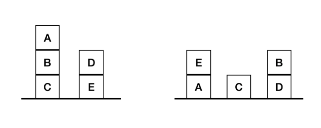

# Question9 : Blocks world problem

## Table of Contents
* [How the program works](#how)
  * [States representation](#states)
  * [States generation](#generation)
* [Sources used](#sources)
* [Notes](#notes)
* [Files](#files)
* [Compile, test and run program](#ctr)
* [Example outputs](#outputs)

## How the program works <a name="how"></a>
### States representation <a name="states"></a>
The program implemented by the files in this directory solves the blocks world problem using the `A* algorithm`. The input is given in the form of a text file, where the first line contains the number of blocks. Then what follows are the blocks and their "child" in the first and goal states. The child of a block is the block that is under it. For example, to represent the following problem:



we would input as is:

```
5
A B
B C
C #
D E
E #

A #
B D
C #
D #
E A
```
\# represents the `table`. The blocks don't have to be a single character necessarily, as strings are used, so we can test from arbitrary number of blocks.

### States generation <a name="generation"></a>
For every state that is removed from the `priority queue` the `generate_next_states` function is called. For every top block is generates all possible moves for it. It does this by cheking every other top block, copying the state, and placing the block being checked on top of a new pile. Also, if the block is not on the ground, it also places it there as an extra move. It then calculates the cost based on the blocks that are out of place and puts all the newly generated states in the priority queue.

### Sources used <a name="sources"></a>
To understand the A* algorithm I used the following sources: [Video 1](https://youtu.be/ySN5Wnu88nE), [Video 2](https://youtu.be/GazC3A4OQTE). Also the following [presentation](https://assets.ctfassets.net/kdr3qnns3kvk/1y7d9UxoFuF7aN6afDftzs/ddb79e8893b8393fc36f6b0feb357b69/BlocksWorld.pdf) to understand the blocks world problem better.


## Notes <a name="notes"></a>
* The program prints the states using a recursive function in a specific format. For example, the state:
```
A B
B C
C #
D E
E #
```

is printed as:
```
|C B A
|E D
```
which is the piles rotated sideways.
* A stack is used to store the states removed from the priority queue, so that they can be freed at the end of the program.

## Files <a name="files"></a>
* `main.c` : The main file of the program.
* `blocks.c` : Contains the implementations of state and block related functions.
* `blocks.h` : The header file of `blocks.c`.
* `Makefile` : The makefile of the program.
* `test_inputs/` : Directory that contains test inputs.
* `priority_queue.c` : Implementation of the priority queue.
* `priority_queue.h` : The header file of `priority_queue.c`.
* `stack.c` : Implementation of the freeing stack.
* `stack.h` : The header file of `stack.c`.
* `test.c` : Tests some functions.
* `execution_times.pdf` : Contains the execution times of the program for different inputs.

## Compile, test and run program <a name="ctr"></a>
* **Compile** : `make` or `make main`
* **Test** : `make test`
* **Run** : `./main <input_file>` where `<input_file>` is the input file that contains the start and goal states as mentioned above or `make run SIZE=<size>` where `<size>` is the number of blocks (check test_inputs folder for valid sizes).
* Do `make clean` to remove unnecessary files. *(executables, object files)*

## Example outputs <a name="outputs"></a>
```
$ make run SIZE=5
Start state:
|C B A 
|E D 
Goal state:
|A E 
|C 
|D B 
Solution steps:
|C B A 
|E D 

|C B A 
|D 
|E 

|A 
|C B 
|D 
|E 

|A E 
|C B 
|D 

|A E 
|C 
|D B 
```
  
```
$ make run SIZE=8
Start state:
|C D B 
|F E 
|H G A 
Goal state:
|C D B 
|G A 
|H F E 
Solution steps:
|C D B 
|F E 
|H G A 

|A 
|C D B 
|F E 
|H G 

|A 
|C D B 
|F E 
|G 
|H 

|C D B 
|F E 
|G A 
|H 

|C D B 
|E 
|F 
|G A 
|H 

|C D B 
|E 
|G A 
|H F 

|C D B 
|G A 
|H F E 
```

```
$ make run SIZE=10
Start state:
|A B C 
|D E F 
|G H I J 
Goal state:
|A D G 
|B E H 
|C I 
|J F 
Solution steps:
|A B C 
|D E F 
|G H I J 

|A B C 
|D E 
|G H I J F 

|A B 
|C 
|D E 
|G H I J F 

|A 
|B 
|C 
|D E 
|G H I J F 

|A 
|B E 
|C 
|D 
|G H I J F 

|A D 
|B E 
|C 
|G H I J F 

|A D 
|B E 
|C 
|F 
|G H I J 

|A D 
|B E 
|C 
|F 
|G H I 
|J 

|A D 
|B E 
|C I 
|F 
|G H 
|J 

|A D 
|B E H 
|C I 
|F 
|G 
|J 

|A D G 
|B E H 
|C I 
|F 
|J 

|A D G 
|B E H 
|C I 
|J F 
```
